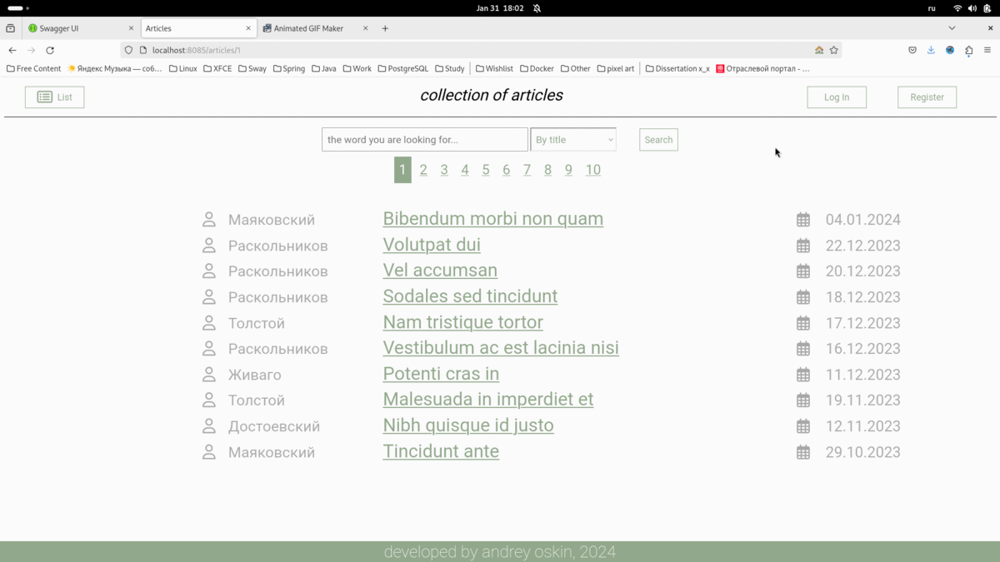
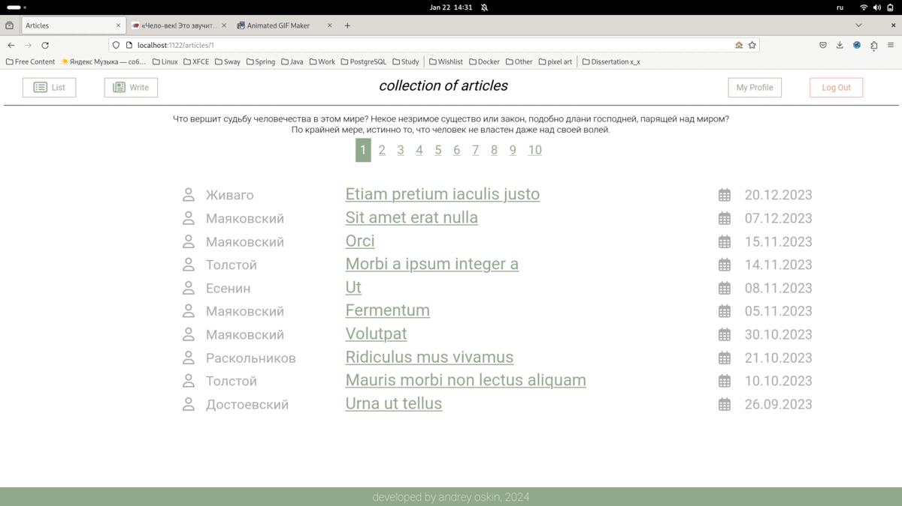
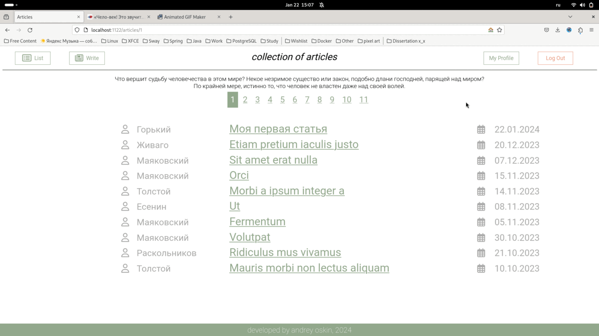
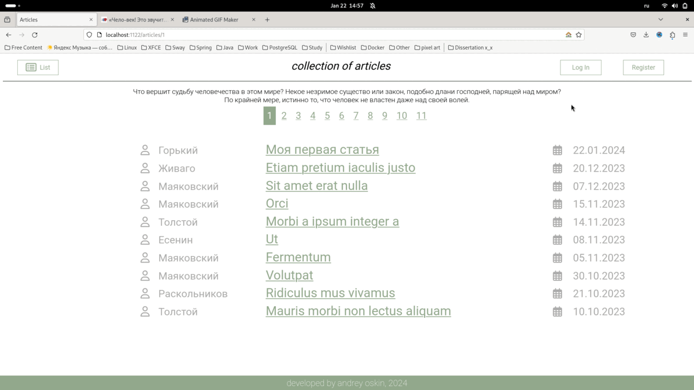
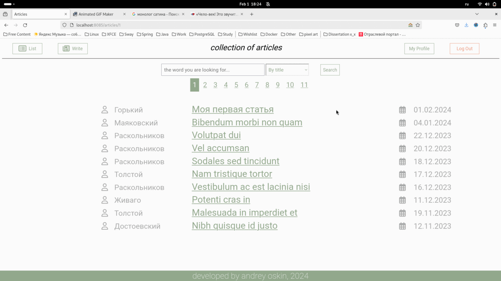

# Articles - веб-приложение для хранения статей

Проект представляет из себя:
1. веб-сайт, на котором можно размещать свои статьи, просматривать чужие и комментировать их;
2. набор сервисов REST API для работы со статьями;

## Запуск
Для запуска достаточно загрузить файл docker-compose.yaml и запустить команды в директории с ним:
- `docker compose build` - собрать связку-контейнеров из файла docker-compose.yaml
- `docker compose up` - запустить связку контейнеров

После выполнения команд будут запущены 2 контейнера, описанные в файле .yaml.
К БД из контейнера можно подключиться извне.
Важно, что порты 5432 и 1125 (порт используемый БД и приложением) не должны использоваться, иначе `docker compose` упадёт.
Можно скорректировать .yaml файл и другие порты выбрать, если эти заняты.

п.с. 
`docker compose` должен быть установлен по умолчанию с `docker-desktop`

Тестовые данные в БД можно загрузить скриптом `insert-test-data.sql`. (7 юзеров с паролями **data**, 100 статей и 200 комментов)

## Документация API
В проект подключён Swagger (библиотека SpringDoc), благодаря чему автоматически генерируется документация OpenAPI на REST-сервисы.
Документация доступна по адресам:
1. http://localhost:1125/swagger-ui/index.html
2. http://localhost:1125/v3/api-docs
   
(если не использованы другие порты)   

## Обзор функционала

### Просмотр постраничного списка статей
По адресу `/articles/id`, где id это номер страницы, можно посмотреть список из 10 статей.
Адрес `/articles` ведёт на 1ую страницу. На каждой из страниц есть навигационные ссылки для перемещения на другие страницы.

Сами статьи кликабельны:
 - по клику на заголовок можно перейти на саму статью;
 - по клику на автора (его фамилию) можно перейти на профиль автора;

### Создание и просмотр конкретной статьи
При нажатии на ссылку "Write" в хедере зарегестрированный пользователь может создать статью.
С помощью поля для ввода ckeditor можно форматировать текст статьи: выделять цитирование, вставлять таблицы и т.д.
После создания статьи, произойдет редеректинг на неё. 
Автор может изменять свои статьи и удалять их. Автор статьи кликабелен и ведёт на профиль пользователя.
Зарегистрированные пользователи могут оставлять к статье комментарии.

По адресу `/article/id`, где id это уникальный идентификатор статьи можно просмотреть конкретную статью.
Сюда же можно попасть переходом из общего списка статей и из профиля автора (раздел "Недавние статьи").

### Регистрация
Зайдя на сайт, пользователь не будет аутенфицирован. Он сможет только читать статьи. Писать новые и оставлять комментарии он не сможет.
Необходимо либо зайти на сайт через "Login", либо зарегистрировать нового пользователя через ссылку в хедере "Register".
При успешной регистрации, произойдет переход на профиль созданного пользователя.

### Профиль пользователя
Помимо основной информации о пользователе, в его профиле содержится информация о последних (по дате) 5 статьях (аналогично списку статей).
Попасть на свой профиль можно через ссылку "My Profile" в хэдере. Перейти на чужой профиль можно через ссылку на автора в статье или комментарии.
Посмотреть любой другой профиль можно по ссылку `/user/id`, где id - идентификатор пользователя.

### Аутенфикация
Вход на сайт осуществляется через `/login`, также сюда перенаправляются запросы неаутенфецированных пользователей при запросах на адреса, которые им недоступны.
После входа происходит перенаправление на страницу со списком статей.
Пароли хранятся в БД в хэшированном виде.

### Комментирование статей
Просматривая статьи, любой аутенфицированный пользователь может оставлять к ним комментарии.
В теле комментария есть гиперссылка на его автора, текст комментария и дата его публикации.

### Изменение статей
Автор статьи может изменить её или удалить.
При удалении происходит возвращение на список статей.

## Логирование
События приложения логируются, логи хранятся в папке [logs](/logs)