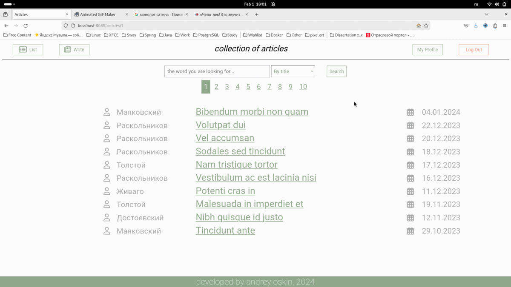
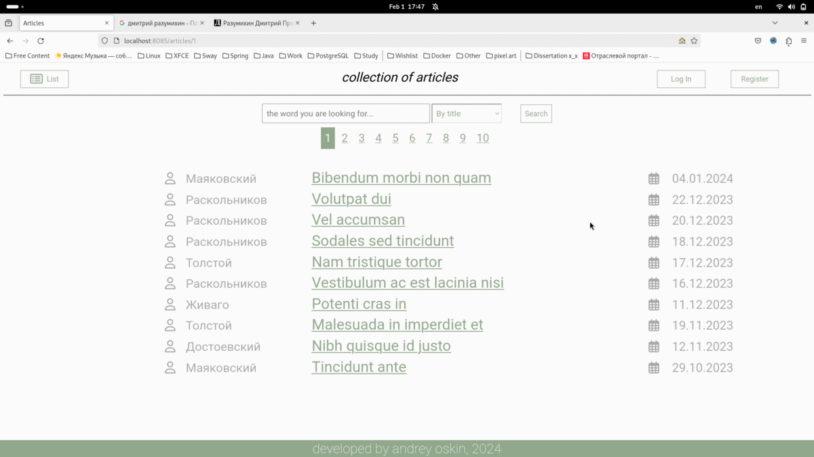
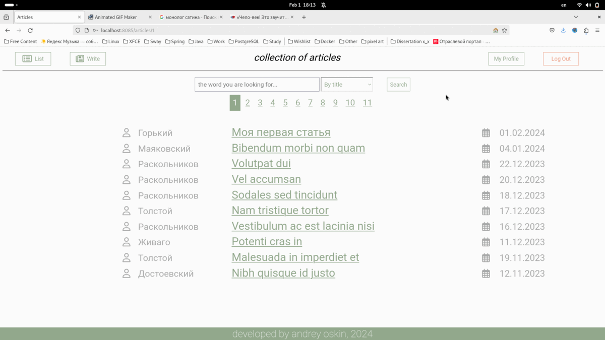

# Articles - веб-приложение для хранения статей

Проект представляет из себя веб-сайт, на котором можно размещать свои статьи, просматривать чужие и комментировать их.

## Запуск
...
Тестовые данные можно импортировать скриптом `test_insert.sql`. 

## Обзор функционалая

### Просмотр списка статей
По адресу `/articles/id`, где id это номер страницы, можно посмотреть список из 10 статей.
адрес `/articles` ведёт на 1ую страницу. На каждой из страниц есть навигационные ссылки для перемещения на другие страницы.

Сами статьи кликабельны:
 - по клику на заголовок можно перейти на саму статью;
 - по клику на автора (его фамилию) можно перейти на профиль автора;

### Создание и просмотр конкретной статьи
При нажатии на ссылку "Write" в хедере зарегестрированный пользователь может создать статью.
С помощью поля для ввода ckeditor можно форматировать текст статьи, выделяя цитирование вставляя таблицы и т.д.
После создания статьи, она будет выведена. 
Автор статьи может изменять их и удалять. Автор статьи кликабелен и ведёт на профиль автора.
К статье можно оставлять комментарии.

По адресу `/article/id`, где id это идентификатор статьи можно просмотреть конкретную статью.
Сюда же можно попасть переходом из общего списка статей и из профиля автора, раздела "Недавние статьи".

### Регистрация
Зайдя на сайт, пользователь не будет аутенфицирован. Он сможет только читать статьи. Писать новые и оставлять комментарии он не сможет.
Необходимо либо зайти на сайт через "Login", либо зарегистрировать нового пользователя через ссылку в хедере "Register".
При успешной регистрации, произойдет переход на профиль созданного пользователя.

### Профиль пользователя
Помимо основной информации о пользователе, в его профиле содержится информация о последних (по дате) 5 статьях (аналогично списку статей).
Попасть на свой профиль можно через ссылку "My Profile" в хэдере. Перейти на чужой профиль можно через ссылку на автора в статье или комментарии.
Посмотреть любой другой профиль можно по ссылку `/user/id`, где id - идентификатор пользователя.

### Аутенфикация
Вход на сайт осуществляется через `/login`, также сюда перенаправляются запросы неаутенфецированных пользователей на адреса, которые им недоступны.
После входа происходит перенаправление на страницу со списком статей.
Пароли хранятся в БД в хэшированном виде.

### Комментирование статей
Просматривая статьи, любой аутенфицированный пользователь может оставлять к ним комментарии.
В теле комментария есть гиперссылка на его автора, текст комментария и дата его публикации.

### Изменение статей
Автор статьи может изменить её или удалить.
При удалении происходит возвращение на список статей.
